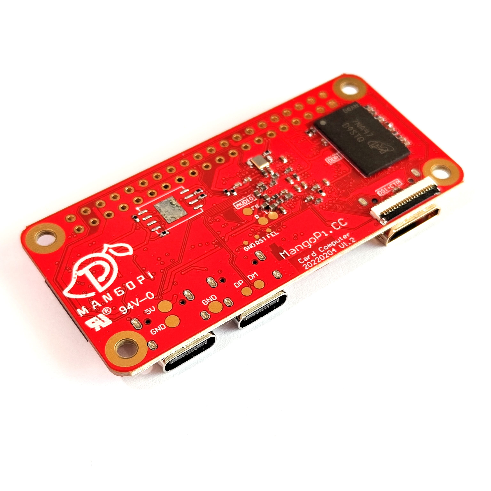

### MangoPi Nezha-MQ

### Introduction

This micro development board is specially designed to run Tina-Linux/Debian. Despite a mini body, it has all the vital functions. Equipped with D1(RISC-V core) as the maincontroller chip, the board offers various commonly-used peripheral ports: GPIO, I2C & SPI, SDIO, Audio port(record, play), Video(touch, HDMI, DVP, DSI and LVDS), USB Host, OTG, etc. Besides, the board comes with a built-in 512MB/1GB DDR and onboard WiFi/BT, which fully supports Linux ecology and running complete Python.

### Spectification
  * D1, C906 Core, RISC-V core up to 1GHz
  * 512MB or 1GB DDR3
  * USB-OTG Type-C
  * USB-HOST Type-C
  * 40Pins RPI-expand
  * 24Pin DVP/RGMII connector
  * mini HDMI
  * TF card
  * RTL8723ds WiFi/BT module
  * 20Pins DSI/CTP/LVDS FPC connector
  * Audio OUT pads
  * onboard WiFi/BT ant
  * 6.5x3cm size

